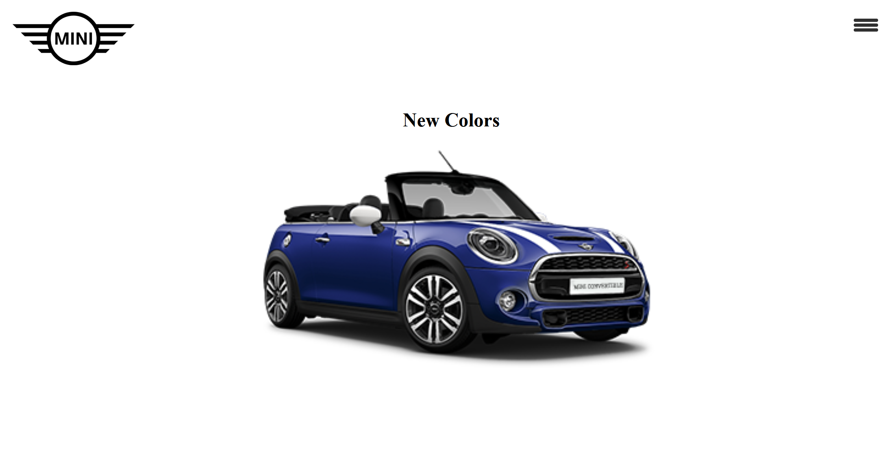

# Mini Cooper App

> Fetching data Dynamically from Database and Using Vue.js framework
---
### Table of contents

- [Description](#description)
- [References](#references)
- [Author](#author)

---

## Description

This Mini Cooper is a platform where all the content is dynamic and pulled from Database using API. UI/UX is set as per Mini.ca. When user clicks on the image, the AJAX request is sent and the fetch call is made using Vue.js. After the request is sent, the data is fetched from database and comes in the form of Json. Vue component is used to is used in here to collect the request and parse the json data.

[Mini App Roadmap](https://docs.google.com/document/d/1TpHGnCcIn6bnD6QrYBVCE3Fy8hYhpX5EnLAdrxudBms/edit?usp=sharing) 

### Languages used
- HTML
- CSS
- SASS
- PHP 
- AJAX
- js
- Vue.js

### Technologies 
- Git bash
- Visual Studio Code

---

## References
- W3schools
- youtube
- MDN learning

---

## Author

Sarthak Shah

